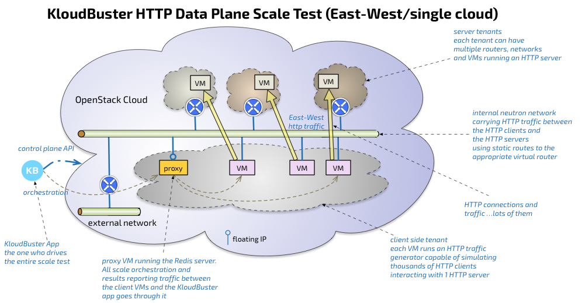
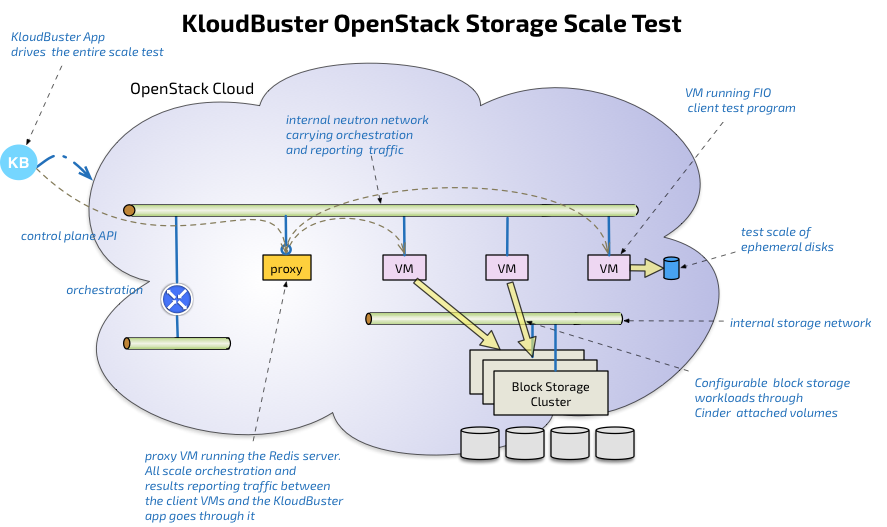

.. _arch:

Architecture
============

Data Plane Scale Test
+++++++++++++++++++++

Although many types of traffic can run on an OpenStack data plane, KloudBuster
focuses on measuring HTTP traffic scale on any OpenStack cloud because it is a
well understood and very popular traffic type and there are many great open
source tools that can scale to the task and can be leveraged to implement the
HTTP scale test.

East-West Data Plane Scale Test
-------------------------------
East-West traffic refers to the traffic that is exchanged between VM instances
that run inside the same cloud. Such traffic can involve:

- Only packet switching if the 2 end points belong to the same Neutron network
  (that is the packets do not have to go through a router) - often called L2
  East-West

- Packet routing if the 2 end points belong to different Neutron networks
  (packets have to go through router) - often called L3 East-West

The KloudBuster data plane scale test exercises L3 East-West traffic by running
a set of HTTP servers in their respective tenant private network and a set of
HTTP traffic generators in a client tenant network with HTTP traffic flowing
from the client tenant network to the various server networks through the
corresponding server router as illustrated in the following diagram:

The KloudBuster App typically runs outside the cloud under test on any server
that has a python interpreter (MacBook, Linux workstation...) with the
requirement to have access to the OpenStack API of the cloud under test.

The KloudBuster app basically reads the requested scale config (which contains
parameters such as test duration, how many HTTP servers are to be used, how many
tenants, networks and routers, how many clients, rate of HTTP requests...),
stages the resources using the OpenStack API, orchestrates the start of the
test, collects then aggregates all the results, then cleans up the resources.

Each HTTP traffic generator instance runs in a VM and is capable of simulating a
large number of HTTP clients that will send HTTP requests to the same HTTP
server instance at a configurable rate (there is a 1:1 mapping between each
client VM and server VM).

Orchestration and results collection is done through the Redis server which runs
in the first staged VM.  Many scale tools use SSH to drive the test agents and
SSH has shown to be hard to scale beyond a few hundred sessions while a solution
based on Redis can scale very easily to thousands of end points. Another
important benefit of using a Redis server is that the scale test only requires 1
floating IP (for the Redis server) since all communication to the client VMs are
performed on the internal network using private addresses. Using SSH directly to
the client VMs would require a lot of floating IPs or would require a proxy
which makes the solution even more brittle.

Rack to Rack Data Plane Scale
-----------------------------

By default KloudBuster will rely on the Nova scheduler to place the various
client and server VMs.  As a result these VMs will be load balanced across all
servers and causing the data path of the HTTP traffic to be quite random. This
can be good to measure the scale on a random traffic pattern but sometimes it is
more interesting to shape the HTTP traffic can be shaped to follow certain
paths.

One good example is to assess the scale of the data plane across racks since
most deployments involve the use of a top of rack switch to service a
potentially large number of servers in each rack. For that purpose, KloudBuster
provides a way to specify the placement of client and server VMs using specific
availability zones as illustrated in the following diagram:

.. image:: images/kb-http-rack-rack.png

The client VMs are placed in 1 rack while the server VMs are placed in a set of
different racks.  Such arrangement will cause the traffic to flow exclusively
between these racks, allowing a good measurement of the data plane capabilities
of each rack.

North South Data Plane Scale Test
---------------------------------

The North South traffic refers to traffic flowing between external sources and
VMs running in the cloud.  Such traffic follows a very different path than
East-West traffic as it is generally always routed and requires the used of IP
address translation (SNAT and DNAT). One exception to this is the use of a
provider network which may avoid routing and NAT completely.

KloudBuster provides a option to test the North-South data plane traffic by
separating the client VMs and server VMs into 2 different OpenStack clouds.

.. image:: images/kb-http-north-south.png

In this mode, KloudBuster will stage and orchestrate the test on 2 distinct
clouds.

Storage Scale Test
++++++++++++++++++

The storage scale test is a relatively simpler version of the data plane scale
test as it only involves 1 tenant, 1 network and 1 router. Each test VM runs one
instance of the FIO test client (`FIO <https://github.com/axboe/fio>`_ which is a
widely adopted open source storage test client).

VM staging, storage plumbing (using Cinder or Nova for ephemeral disks) is done
by the KloudBuster app using OpenStack APIs. Because the Cinder API abstracts
the storage back-end, it is agnostic of the technology used (Ceph, EMC...).
After the test, all resources (volumes, VMs, network, router) are cleaned up in
the proper order.

Progression Runs
++++++++++++++++

VM staging is a very lengthy phase of any scale test especially when dealing
with scales of hundreds or thousands of VMs.

Progression runs are a very convenient feature as it allows to produce result
for series in a much shorter time by reusing the same set of staged VMs and
iterating the scale test to produce measurements at different scale level.

For example, to get storage performance measurement for 100 to 1000 VMs in
increments of 100, would require staging and unstaging 100+200+300+....+1,000 =
5,500 VM Instances without progression runs while it would only require staging
1,000 instances with VM reuse.

Latency and Distributed Latency at Scale
++++++++++++++++++++++++++++++++++++++++

Latency is a critical metric and reporting correctly latency at scale in a
distributed environment is a difficult problem.

An example of HTTP scale test could simulate 1 million HTTP users sending a
combined 100,000 HTTP requests per second for 1,000 seconds across say 1,000
HTTP servers and 1,000 HTTP traffic generators. A good characterization of how
well a cloud supporting these 1,000 HTTP servers behaves is not only to measure
the actual combined HTTP requests per seconds achieved (e.g. 70,000 HTTP
request/per second) but also the latency of these HTTP requests with a
precision of 1 millisecond. For this kind of scale, the only proper way to
measure latency is to have the complete latency distribution percentile for all
70,000 * 1,000 = 70 million HTTP operations. The problem is that these 70 M
operations are distributed across 1,000 client VMs and as such each traffic
generator has only the latency distribution of those requests issued locally
(or about 70,000 HTTP operations per VM).

Similarly, assessing the storage scale of 500 VMs doing 400 IOPs each results
in tracking the latency of a combined 200K IO operations per second. A mere
10-minute run results in tracking the latency for over 100M IO operations,
distributed across 500 VMs.

Many scaling tools take the shortcut of only reporting an average per client VM
(or even min or max - each client only has to report a small number of metrics
per run). The aggregation of all these averages makes the reported result
(average of averages, min/max of averages...) very weak because it completely
loses sight of outliers which is precisely the type of detail you need to assess
accurately the scale of a large distributed system.

To solve that problem, KloudBuster uses the `HdrHistogram
<https://github.com/HdrHistogram>`_ open source library to do loss-less
compression/decompression of full latency histograms on the fly in a highly
scalable way.
