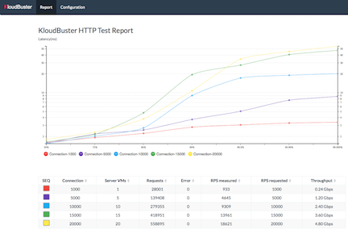
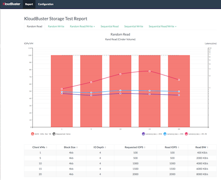

.. _gallery:

Gallery
=======

This page has links to examples of scale test reports in HTML format generated
by KloudBuster.  These reports were generated within minutes after starting the
scale test from a bare bone OpenStack cloud (not running anything).  Click on
the thumbnail images to view the result HTML file in your browser (you will
need access to the Internet to view these files as they reference multiple Java
script libraries in CDN).

Sample HTTP Scale Report
------------------------

The following report shows an HTTP scale run with results for 1 to 20 HTTP
servers (running in as many server VMs) in increment of 5, where each HTTP
server is receiving HTTP requests from 1 HTTP traffic generator that runs in a
separate VM and emulates 1,000 users sending 1 request per second each (for a
total of 1000 requests per second per HTTP server).  The topology used for the
test is 1 tenant, 1 router, 4 networks and 5 HTTP servers per network.  Each
iteration is programmed to run for 30 seconds.  This scale settings can be
viewed in the Configuration tab.

The table shows the results for each iteration step, with the requested and
measured RPS (HTTP requests per second) and the corresponding aggregated
download throughput (the sum of all downloads for all clients).

Each line in the chart represents the latency distribution for one load level
(or iteration in the progression). Lines can be individually
shown/hidden by clicking on the corresponding legend item.

For example, the largest scale involves 20,000 simultaneous users sending an
aggregate of 18,621 HTTP requests per second and the latency chart tells us
that 99.9% of these 18,621 requests are replied within 34ms, which is actually
excellent.

Note that this test is configured to reuse HTTP connections meaning that we do
not have the overhead of creating a new TCP connection for every HTTP request.
This also means that this cloud had 20,000 TCP active connections at all times
during the scale test.

Sample HTTP Monitoring Report
-----------------------------

The report below shows an HTTP monitoring run with 15 HTTP servers where each
HTTP server is receiving HTTP requests from 1 HTTP traffic generator that runs
in a separate VM and emulates 1,000 users sending 1 request per second each
(for a total of 1000 requests per second per HTTP server).  The topology used
for the test is 1 tenant, 1 router, 3 networks and 5 HTTP servers per network.
The total duration is set to 300 seconds. This scale settings can beviewed in
the Configuration tab.

This stacked chart updates in real time by scrolling to the left and shows
how the latency of HTTP requests evolves over time for each percentile group
(50%, 75%, 90%, 99%，99.9%， 99.99%, 99.999%). Lines can be individually
shown/hidden by clicking on the corresponding legend item.

The compute node where the HTTP servers run is protected against individual
link failures by using a link aggregation with 2 physical links connected to
2 different switches.

At 12:19:53, one of the 2 physical links is purposely shut down. As can be seen,
the latency spikes as high as 1664 msec and returns to normal after about 10
seconds.

.. image:: images/kb-http-monitoring.png

Sample Storage Scale Report
---------------------------

This is a report for a storage scale test using the default workload suite with
a progression run from 1 VM to 20 VMs in increment of 5, and 30 second run per
iteration.  This results in 6 tabs of results (1 per workload). The mixed
read/write tabs further split in 2 sub tabs (1 for read and 1 for write
results).

The random read tab shows that each VM could achieve its requested 100 IOPs
across the progression.  The lines represent the latency value at given
percentile and can be individually shown/hidden by clicking the corresponding
legend item.  As an example, 20 VMs represents a combined 2,000 IOPs measured
for a total of 60,000 random read operations.  The latency line tells us that
99.9% of these 60,000 read operations are completed within 1.576 msec.

The sequential write results are more challenging as they show that the VMs
cannot achieve their requested write bandwidth (60MB/s) and can only get 49MB/s
each when there are 20 of such VMs.  The latency lines also reflect that stress
by peaking at 500 ms for 99.99% of all write operations (although latency is
not nearly as critical for sequential access than for random access).

